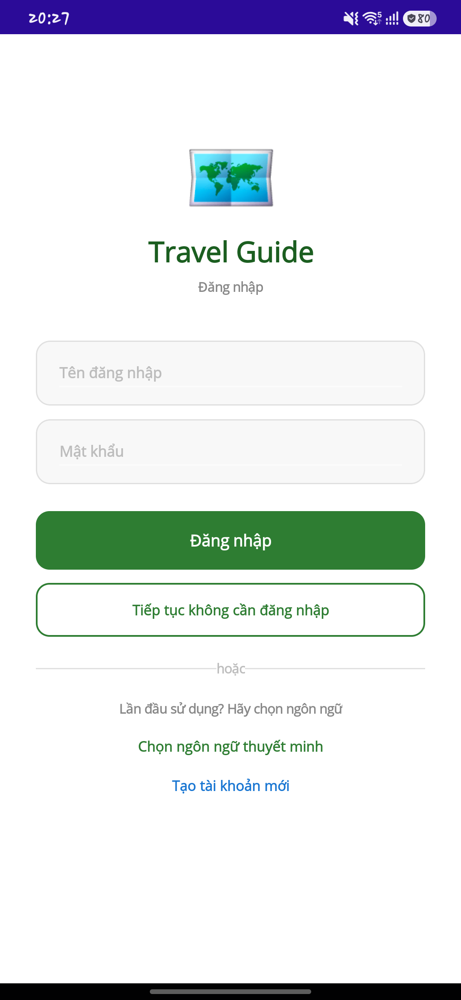
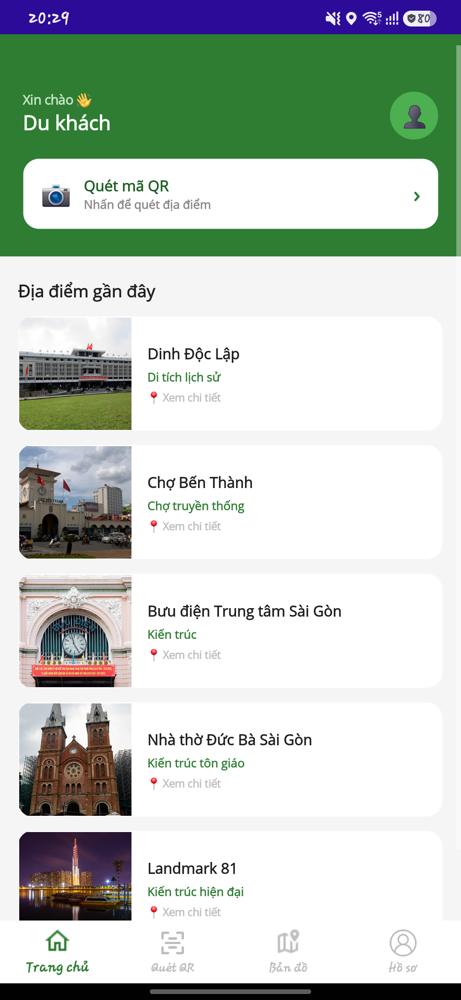
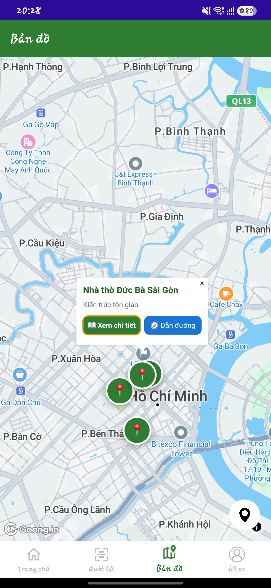
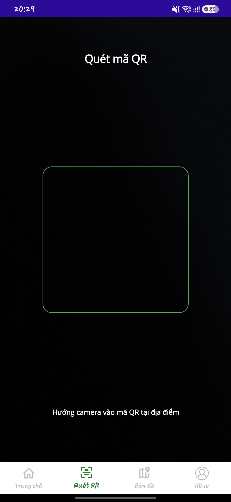
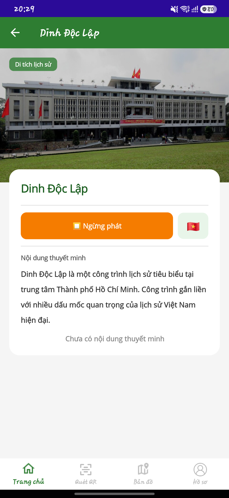
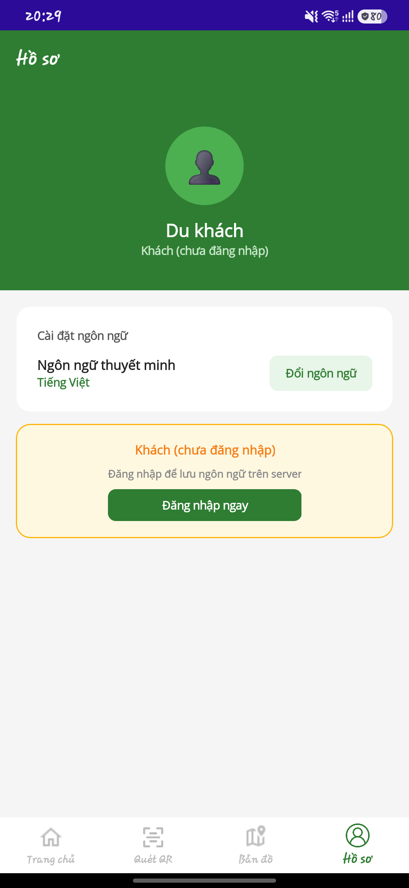
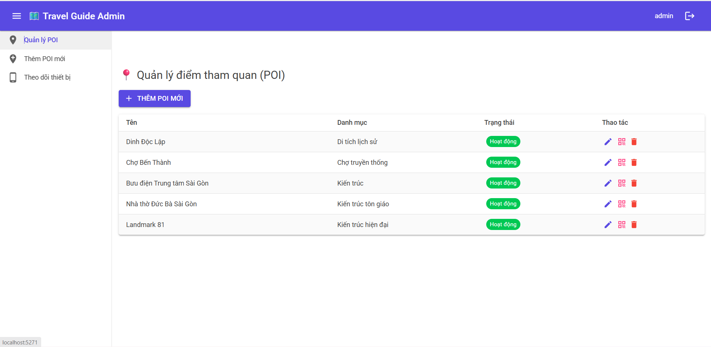
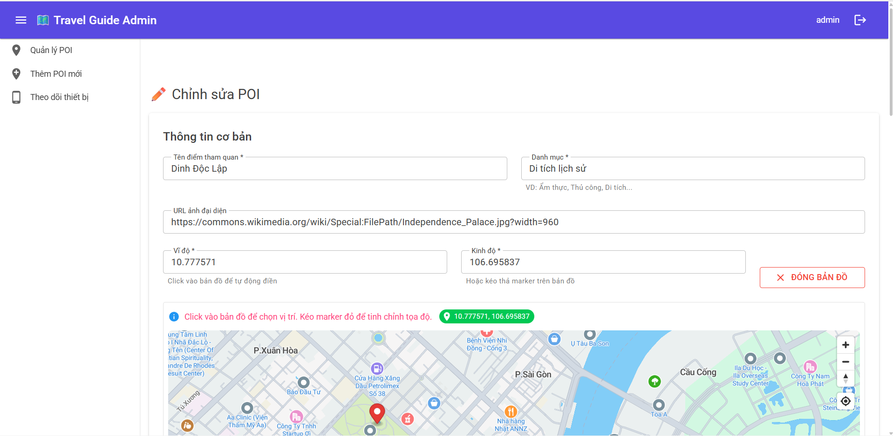
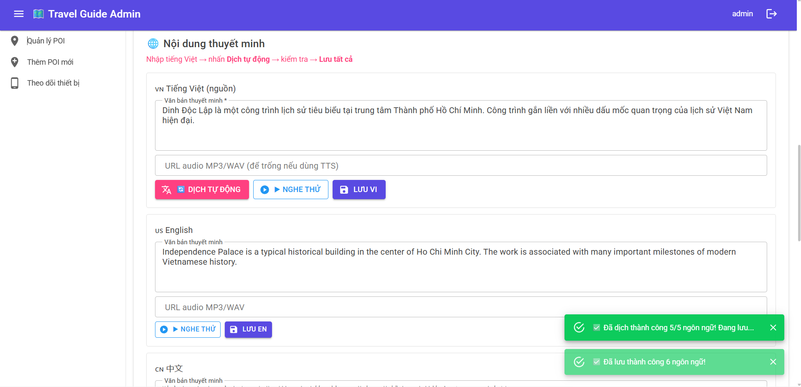
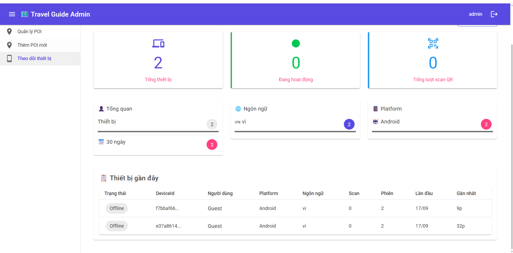

# Travel Guide – Ứng dụng hướng dẫn du lịch thông minh

Hệ thống hướng dẫn du lịch đa nền tảng giúp người dùng khám phá địa điểm (POI), xem bản đồ, quét QR, nghe thuyết minh đa ngôn ngữ và tiếp tục sử dụng dữ liệu đã lưu khi mất mạng. Phiên bản đầy đủ hiện nằm trên nhánh **`main`**.

## Thành viên

| MSSV | Thành viên | Phụ trách chính |
| --- | --- | --- |
| 3123411123 | Nguyễn Vũ Huy | Thiết kế giao diện, sơ đồ PRD và phát triển Frontend |
| 3123411221 | Phạm Nguyên Phát | Phát triển Backend và xây dựng nội dung, thông tin PRD |

Đây là project nhóm 2 người. Quy ước làm việc và phạm vi phụ trách của từng thành viên được ghi trong [CONTRIBUTING.md](CONTRIBUTING.md).

## Kiến trúc và công nghệ

- **Mobile:** C#, .NET MAUI, XAML, ZXing.Net.Maui, SQLite, Text-to-Speech.
- **REST API:** ASP.NET Core 8, Controller–Service–Repository, JWT Bearer, BCrypt.
- **Admin Web:** Blazor Server, MudBlazor.
- **Dữ liệu:** SQL Server, Entity Framework Core, migrations; SQLite dùng cho cache offline trên mobile.
- **Tích hợp:** Goong Maps/Direction API, QR code, REST/JSON, nội dung đa ngôn ngữ.
- **Kiểm thử:** xUnit cho các luồng xác thực, phân quyền và POI tiêu biểu.

```text
.NET MAUI / Blazor Admin
          │ REST + JWT
          ▼
ASP.NET Core Controllers
          ▼
       Services
          ▼
     Repositories / EF Core
          ▼
       SQL Server
```

## Tính năng chính

- Đăng ký, đăng nhập bằng JWT; mật khẩu được băm bằng BCrypt.
- Phân quyền User/Admin; API quản trị POI yêu cầu role Admin.
- Xem danh sách và chi tiết địa điểm theo ngôn ngữ, fallback về tiếng Việt.
- Bản đồ, vị trí hiện tại và chỉ đường qua Goong.
- Quét QR/deep link để mở địa điểm.
- Thuyết minh bằng giọng nói và cache SQLite phục vụ chế độ offline.
- Admin Web quản lý POI, nội dung đa ngôn ngữ, QR và thiết bị.
- Swagger/OpenAPI cho việc xem và thử API.

## Yêu cầu môi trường

- Git.
- [.NET 8 SDK](https://dotnet.microsoft.com/download/dotnet/8.0).
- Visual Studio 2022 với workload **.NET Multi-platform App UI development** để chạy MAUI.
- SQL Server LocalDB (Windows) hoặc một SQL Server có thể truy cập.
- Goong Maptile key và REST API key của riêng bạn.

Không sử dụng lại key từng xuất hiện trong lịch sử Git. Hãy thu hồi/rotate chúng trên Goong Dashboard trước khi chạy project.

## Chạy dự án cục bộ

### 1. Clone và restore

```powershell
git clone https://github.com/HiImNVH/SGU-DCT123C1-G12-Cs.git
cd SGU-DCT123C1-G12-Cs
git switch main
dotnet restore project/TravelGuide.sln
```

### 2. Cấu hình API an toàn

Project không còn lưu JWT signing key hoặc mật khẩu admin trong source. Dùng .NET User Secrets:

```powershell
cd project/TravelGuide.API
dotnet user-secrets set "Jwt:Key" "<random-secret-it-nhat-32-ky-tu>"
dotnet user-secrets set "ConnectionStrings:DefaultConnection" "Server=(localdb)\MSSQLLocalDB;Database=TravelGuideDb;Trusted_Connection=True;TrustServerCertificate=True;"
```

Nếu cần một tài khoản demo cục bộ, bật seeder bằng credential chỉ dành cho demo:

```powershell
dotnet user-secrets set "SeedAdmin:Enabled" "true"
dotnet user-secrets set "SeedAdmin:Username" "demo-admin"
dotnet user-secrets set "SeedAdmin:Password" "<demo-password-rieng>"
```

Seeder không ghi mật khẩu ra log. Mẫu đầy đủ nằm tại `project/TravelGuide.API/appsettings.Example.json`.

### 3. Tạo/cập nhật database và chạy API

Từ thư mục `project/TravelGuide.API`:

```powershell
dotnet tool install --global dotnet-ef
dotnet ef database update
dotnet run
```

API lắng nghe tại `http://localhost:5171`. Khi chạy ở môi trường Development, Swagger mở tại [http://localhost:5171](http://localhost:5171).

### 4. Cấu hình và chạy Admin Web

Mở terminal khác:

```powershell
cd project/TravelGuide.AdminWeb
dotnet user-secrets set "ApiSettings:BaseUrl" "http://localhost:5171"
dotnet user-secrets set "GoongSettings:MaptileKey" "<goong-maptile-key-moi>"
dotnet run
```

URL của Admin Web được in ra console khi khởi động. Đăng nhập bằng tài khoản demo đã tự cấu hình ở bước 2; repo không cung cấp mật khẩu mặc định dùng chung.

### 5. Cấu hình và chạy Mobile

Giá trị mặc định của API trên Android Emulator là `http://10.0.2.2:5171`. Với thiết bị thật, đặt `TRAVELGUIDE_API_BASE_URL` thành địa chỉ IP LAN của máy chạy API và bảo đảm firewall cho phép cổng 5171.

Mobile đọc ba biến sau, xem [.env.example](.env.example):

```text
TRAVELGUIDE_API_BASE_URL
TRAVELGUIDE_GOONG_MAPTILE_KEY
TRAVELGUIDE_GOONG_API_KEY
```

Trong cấu hình debug Android, có thể sao chép `project/TravelGuide/Platforms/Android/environment.txt.example` thành `environment.txt`, điền key riêng rồi build. File thật đã bị Git ignore. Key nhúng trong ứng dụng client vẫn có thể bị trích xuất, vì vậy phải dùng key giới hạn domain/app/quota; với production nên proxy Directions API qua backend.

Chạy bằng Visual Studio hoặc:

```powershell
dotnet build project/TravelGuide/TravelGuide.csproj -f net8.0-android
```

## Chạy unit test

```powershell
dotnet test project/TravelGuide.Tests/TravelGuide.Tests.csproj
```

Bộ test hiện kiểm tra đăng ký trùng username, đăng nhập sai mật khẩu, token/role Admin, phân quyền Admin Controller, POI không tồn tại, fallback ngôn ngữ và lọc POI đang hoạt động.

## Demo và tài liệu

- Danh sách ảnh minh họa của hệ thống: [docs/DEMO.md](docs/DEMO.md).
- Phân công nhóm, quy ước commit và luồng kỹ thuật chính: [CONTRIBUTING.md](CONTRIBUTING.md).
- PRD: [PRD/PRD.pdf](PRD/PRD.pdf).
- Sơ đồ UML: thư mục [`UML img`](UML%20img).

### Ảnh ứng dụng Android

| Đăng nhập | Trang chủ | Bản đồ Goong |
| --- | --- | --- |
|  |  |  |

| Quét QR | Chi tiết địa điểm | Hồ sơ |
| --- | --- | --- |
|  |  |  |

### Ảnh Admin Web

| Quản lý địa điểm | Chỉnh sửa vị trí trên bản đồ |
| --- | --- |
|  |  |

| Nội dung thuyết minh đa ngôn ngữ | Theo dõi thiết bị |
| --- | --- |
|  |  |

Đây là ảnh chụp trực tiếp từ ứng dụng Android và Admin Web đang chạy với dữ liệu cục bộ.

## Bảo mật

- Không commit key, password, connection string production hoặc file cấu hình cục bộ.
- Dùng User Secrets khi phát triển và secret manager của nền tảng khi deploy.
- Nếu một secret từng được commit, xóa ở commit mới là chưa đủ: phải rotate secret và cân nhắc làm sạch lịch sử Git.
- Quy trình chi tiết xem [SECURITY.md](SECURITY.md).

## Trạng thái project

Đây là sản phẩm học tập do nhóm 2 thành viên phát triển. Backend, database, migration, authentication, Admin Web và các luồng chính trên mobile đã được triển khai. Repo đã có bộ ảnh ứng dụng Android và Admin Web; deployment production chưa hoàn thành.
